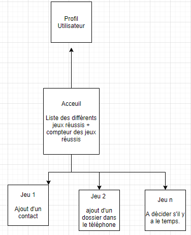

# Projet dev mobile: Bee ware
Groupe 3 : Rémi Feydit, Olivier Verrier, Mathieu Caselles, Antoine Durand

11/10/2020

## Mise en situation:
Notre application sera un jeu de réflexion basé sur plusieurs énigmes. 
Le jeu sera lancé par l'utilisateur lorsqu'il souhaite passer le temps, se divertir et elle montrera à l'utilisateur la "puissance" des applications en terme d'espionage dans nos smartphones.

## Cahier des charges:
### *Navigation*

L'application se compose d'une page accueil, une page profil et d'une multitudes de pages d'énigmes:

- La page d'accueil est une liste des différentes énigmes. 
- La page profil doit être accessible via tabs ou side menu.
- Les pages énigmes sont accessible en cliquant sur un item de la page liste.

### Fonctionnalités :

#### **Profil**:  
Certains champs disponibles dans cette page doivent pouvoir être modifiés
(IonInput ou IonAlert par exemple) simplement par l’utilisateur. Ces champs
sont les suivant :
- Nom
- Photo de profil (IonImg)  

D'autres ne sont que des informations non modifiable:
- Nombre d'énigmes résolues (IonBadge)
- Nombres d'énigmes restantes (IonBadge)
- Temps passé par niveaux

#### **Liste**:  
Cette page affiche la liste des énigmes disponible.  
Chaque item est présenté sous la forme d’une IonCard avec les informations suivante :
- Logo (IonImg)
- Mini logo contenant soit V soit X en fonction de si l'énigme a été réussi ou pas.
- Un nombre d'étoile estimant le niveau de difficulté.
- Une phrase d'accroche (IonToast qui apparaît si on maintient cliqué sur le IonCard)

Les cartes sont cliquables et permettent d’accéder à l'énigme associé.

#### **Énigme 1**
Cette énigme est à résoudre grâce à un code à trouver.
Elle contiendra:
- Input pour rentrer le code permettant de résoudre l'énigme.
- Une image indice ou un petit texte permettant la résolution de l'énigme.
- L'énigme ajoutera en arrière plan un nouveau contact "Bee Ware" dans le répertoire du téléphone. Ce contact contiendra le code permettant de résoudre l'énigme.

#### **Énigme 2**
Cette énigme est à résoudre grâce à un code à trouver.
Elle contiendra:
- Input pour rentrer le code permettant de résoudre l'énigme.
- Une image indice ou un petit texte permettant la résolution de l'énigme.
- L'énigme ajoutera en arrière plan une image dans l'album du téléphone qui donnera un indice renvoyant vers un bloc-note qui contiendra le mot de passe.

#### **Énigme 3**
Cette énigme est à résoudre grâce à un code à trouver.
Elle contiendra:
- Input pour rentrer le code permettant de résoudre l'énigme.
- Une image indice ou un petit texte permettant la résolution de l'énigme.
- Lorsque l'utilisateur aura compris qu'il doit vérouiller son téléphone, il recevra un msg contenant le code pour la résolution de l'énigme. (L'application enverra un msg à l'utilisateur en utilisant la messagerie de ce dernier (Comme si l'utilisateur s'était envoyé un msg à lui même / à son propre numéro.))

#### **Énigme 4**
Cette énigme est à résoudre grâce au gyroscope du téléphone.
Elle contiendra:
- Un bouton caché sous un drap permettant de résoudre l'énigme.
- Retourner le téléphone permet de le faire tomber, ce qui dévoilera le bouton.

#### **Énigme N**
On rajoutera d'autres énigmes en fonction du temps que nous prendront les premières énigmes à développer.

### *Techno utilisés*:

- Ionic (React, TypeScript)
- Github

### *Style*:
L'application sera utilisable sur mobile.  
Le logo de l'application sera une abeille:
  
Donc l'application suivra les couleurs de l'abeille, donc jaune avec le code hexadécimal `#ffb708` et noir avec le code `#1c1c1c`.

### *Contrainte*:
Deadline: 14 décembre